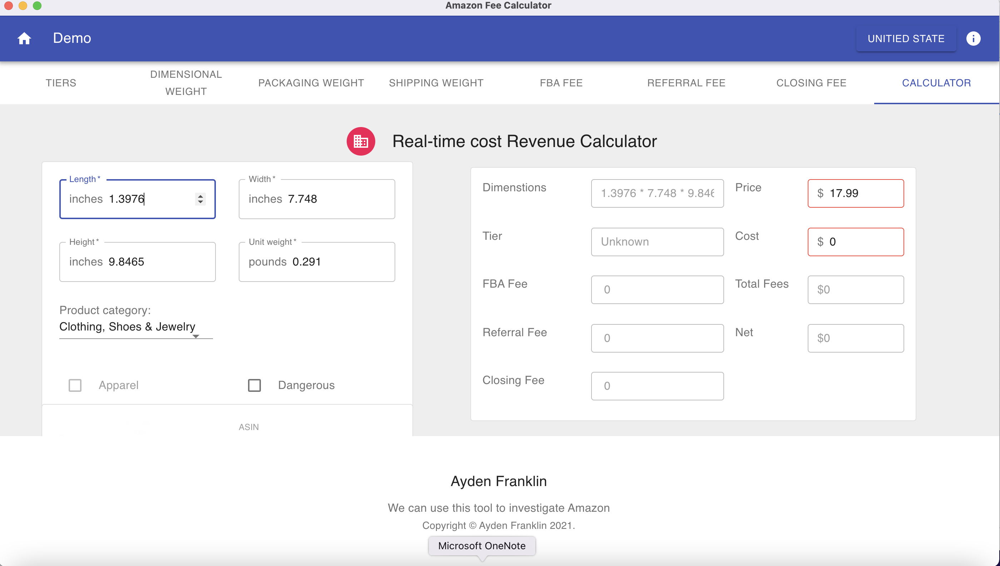

# Description
This is a calculator for Amazon fee including FBA fee, referral fee and variable closing fee. According to the rules published on Amazon website, the fees can be calculated with dimension information, price and category.

### Screen shot

# Supported marketplaces
U.S, Canada and Mexico are suppoerted currently. I'll add other marketplaces in the future.
# How to run
1. Clone this project and run `npm install` or `yarn install`
2. Run `npm run start:render` first and open another terminal to run `npm run start:main`
3. (Optional) Run `npm run test` for unit tests.
